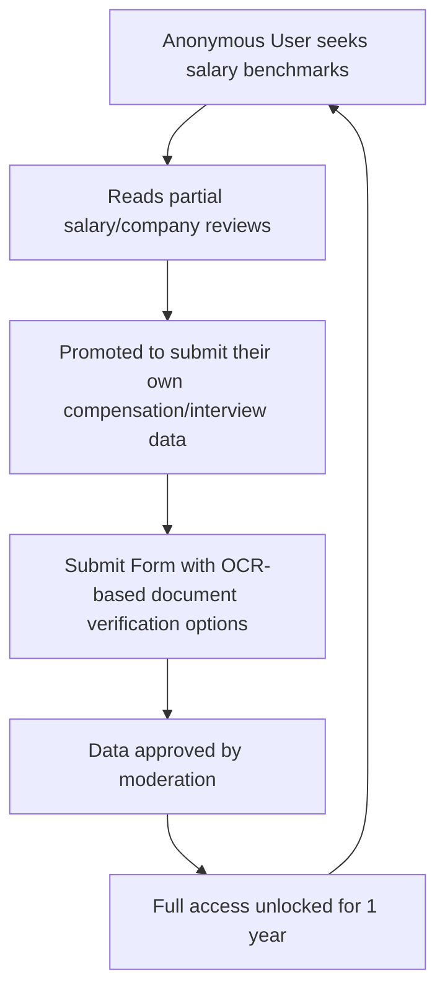
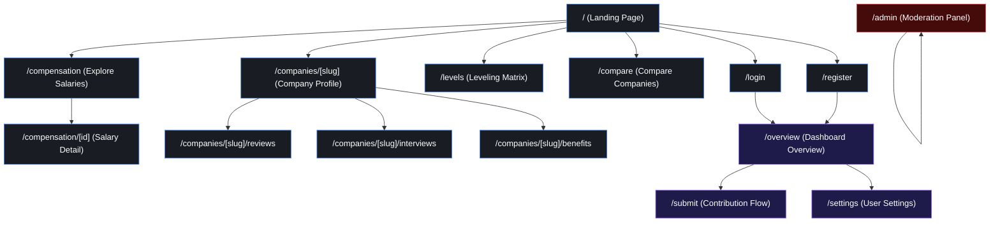
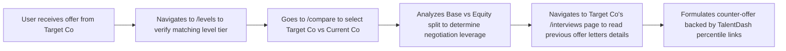
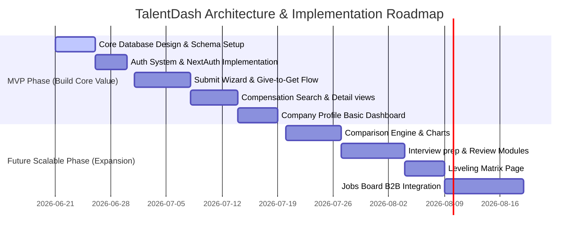

# TalentDash — Product Architecture & UX Strategy

## 1. Deep Product Analysis & Strategy

TalentDash is a next-generation compensation intelligence platform. It bridges the gap between high-fidelity salary benchmarking (pioneered by Levels.fyi), crowd-sourced company culture reviews (pioneered by Glassdoor), and granular workplace analytics (pioneered by AmbitionBox).

### Competitive Advantage & Value Position

| Competitor | Strengths | TalentDash Differentiation |
| :--- | :--- | :--- |
| **Levels.fyi** | High-quality salary data, leveling clarity. | Better integration of subjective culture metrics (reviews) and structured interview prep directly linked to salary bands. |
| **Glassdoor** | High review volume, company profiles. | Data cleanliness, focus on total compensation detail (base/equity/bonus splits), protection against company review manipulation. |
| **AmbitionBox** | Comprehensive review features in emerging markets. | Global normalization of roles, modern interactive analytics dashboard, and privacy-first verification. |

### The "Give-to-Get" Growth Engine
The core product growth engine relies on a strict value loop:


---

## 2. Product Page Definition Matrix

### MVP Page Definitions (Core Value Proposition)

#### 1. Landing & Universal Search Page (`/`)
*   **Why**: The top-of-funnel entry point for organic search and direct traffic. Needs to establish trust and direct users to information instantly.
*   **Purpose**: Offer a high-performing search bar targeting companies, job titles, and locations. Display real-time aggregated metrics (e.g., "Average Software Engineer Salary in SF: $210k") and trending companies.
*   **Business Value**: Drives search engine optimization (SEO) indexation, user acquisition, and initial engagement. Reduces bounce rates by immediately surfacing high-intent data.

#### 2. Dashboard Overview (`/overview`)
*   **Why**: Serves as the central homepage for authenticated users, organizing personalized data, search history, and saved roles.
*   **Purpose**: Aggregates compensation benchmarks, comparison widgets, and custom salary alerts relevant to the user's defined job title and experience level.
*   **Business Value**: Increases daily/weekly active users (DAU/WAU) and user retention. Serves as the launchpad for upsells (e.g., premium career coaching or negotiation services).

#### 3. Compensation Search & Filter Matrix (`/compensation`)
*   **Why**: Users require an open, exploratory way to slice and dice compensation data without static constraints.
*   **Purpose**: Provide a tabular, highly filterable database of salary records. Includes search dimensions for job title, location, years of experience, company size, and date submitted.
*   **Business Value**: Solves the core user search need. Drives high-intent pageviews and user conversion to the "Give-to-Get" funnel.

#### 4. Compensation Detail Sheet (`/compensation/[id]`)
*   **Why**: Allows granular verification of individual salary submissions.
*   **Purpose**: Break down the selected compensation into base salary, variable bonus, and equity (RSU/options) splits. Display location details, years of experience, level name, and a "Verified" badge if backed by an offer letter/W2.
*   **Business Value**: Establishes high data credibility, prompting users to share specific listings, increasing referral loop metrics.

#### 5. Company Explorer Profiles (`/companies/[slug]`)
*   **Why**: Jobs seekers research companies holistically, not just generic job titles.
*   **Purpose**: Dynamic profile page displaying average total compensation, rating aggregations (work-life balance, career growth, culture), review summaries, and basic company metadata.
*   **Business Value**: Targets high-volume branded SEO keywords (e.g., "Google salary", "Stripe benefits"). Acts as the primary funnel to list active job openings for partner employers.

#### 6. Structured Submission Flow (`/submit`)
*   **Why**: Crowd-sourced platforms require a high-converting, friction-free contribution wizard to sustain data growth.
*   **Purpose**: A multi-step form guiding users to enter their employer, location, job title, level, experience, base, variable, equity, and upload an optional offer letter/paystub (for verification).
*   **Business Value**: Captures the lifeblood of the platform (proprietary data). Document verification increases overall database quality, a major pricing differentiator.

#### 7. Authentication Suites (`/login`, `/register`)
*   **Why**: Secure account creation is required to manage submissions and save user configurations.
*   **Purpose**: Secure entry points utilizing email/password and OAuth (Google, LinkedIn, GitHub).
*   **Business Value**: Builds the registered user base, allowing targeted email notifications, market reports, and compliant data stewardship.

#### 8. User Account Settings (`/settings`)
*   **Why**: Regulatory compliance (GDPR/CCPA) and account hygiene require user self-service.
*   **Purpose**: Allow profile updates, password modification, and data deletion requests.
*   **Business Value**: Ensures legal compliance and builds trust by letting users manage their privacy and data visibility.

---

### Future Scalable Page Definitions

#### 1. Interactive Comparison Tool (`/compare`)
*   **Why**: Active job seekers weigh offers side-by-side during negotiation phases.
*   **Purpose**: Side-by-side data visualization comparing salary bands, equity growth potential, benefits, and ratings between 2 to 4 companies.
*   **Business Value**: Retains active candidates at the absolute bottom of the career-change funnel, opening up opportunities for high-margin negotiation advisory services.

#### 2. Specialized Company Reviews Hub (`/companies/[slug]/reviews`)
*   **Why**: Separates quantitative data (salary) from qualitative data (culture) for cleaner UX.
*   **Purpose**: Filterable repository of pros/cons, work conditions, leadership ratings, and department-specific reviews.
*   **Business Value**: Enhances long-tail SEO. Boosts time-on-site metrics through high-interest qualitative reading.

#### 3. Interview Experience Log (`/companies/[slug]/interviews`)
*   **Why**: Candidates want to know *how* to get the salary packages displayed on the platform.
*   **Purpose**: A crowd-sourced registry of interview structures, specific questions asked, difficulty ratings, and offer outcomes.
*   **Business Value**: Attracts users earlier in the recruitment process, transforming TalentDash from a pure compensation research tool to an end-to-end interview prep companion.

#### 4. Perks & Benefits Explorer (`/companies/[slug]/benefits`)
*   **Why**: Non-cash compensation (parental leave, health insurance, work-from-home stipends) comprises up to 30% of total compensation value.
*   **Purpose**: Interactive checklist and verification system of physical, financial, and lifestyle perks offered by employers.
*   **Business Value**: Monetizes corporate employers who want to showcase premium perks to attract top tier talent.

#### 5. Leveling Matrix Chart (`/levels`)
*   **Why**: Standardizing job levels (e.g., L5 at Google vs. ICT4 at Apple) is complex but critical for accurate salary comparison.
*   **Purpose**: Dynamic matrix grid showing normalized levels (Junior, Mid, Senior, Staff, Principal) cross-referenced against custom company levels.
*   **Business Value**: Establishes TalentDash as the definitive industry authority on leveling, driving backlink growth and B2B recruiter usage.

#### 6. Employer Job Board (`/jobs`)
*   **Why**: Directly connects candidate intent with employer requirements.
*   **Purpose**: Job listing feed that maps salaries posted by employers to actual crowd-sourced compensation benchmarks on the site.
*   **Business Value**: Direct B2B monetization channel via pay-per-post, sponsored jobs, and candidate application routing.

#### 7. Admin & Moderation Console (`/admin`)
*   **Why**: Manual and automated data moderation is required to prevent fake submissions, spam, or PII leaks.
*   **Purpose**: Back-office dashboard for reviews, verifying documents, matching companies, and tracking fraud markers.
*   **Business Value**: Secures the database against malicious actors, preventing brand degradation and maintaining data integrity.

---

## 3. Product Sitemap

Below is the complete site navigation tree indicating URL paths, page hierarchy, and accessibility permissions (Public vs. Authenticated vs. Admin).



---

## 4. Information Architecture (IA) & Data Flow

Information Architecture charts how core data schemas relate to each page view to maximize query efficiency and contextual relevance.

### Schema Entity Relationship Summary
```
+-------------------+           +-----------------------+           +-------------------+
|     Companies     | 1       * |  CompensationRecords  | *       1 |       Users       |
|-------------------|-----------|-----------------------|-----------|-------------------|
| - id (UUID)       |           | - id (UUID)           |           | - id (UUID)       |
| - name            |           | - company_id (FK)     |           | - email           |
| - domain          |           | - user_id (FK)        |           | - role (Enum)     |
| - industry        |           | - job_title           |           | - locked (Bool)   |
| - verified (Bool) |           | - base_salary         |           +-------------------+
+-------------------+           | - variable_pay        |
                                | - equity              |
                                | - location            |
                                | - total_compensation  |
                                | - status (Enum)       |
                                +-----------------------+
```

### Page-to-Data Entity Association Mapping

1.  **Landing Page (`/`)**:
    *   *Reads*: Aggregated statistics (Average Total Comp by job category), top 5 trending Companies (by submission volume), recent verified salary additions.
2.  **Dashboard Overview (`/overview`)**:
    *   *Reads*: Current User session, User's submission history (`CompensationRecords` where `user_id = current_user`), targeted `CompensationRecords` matched against user's job title.
3.  **Compensation Search (`/compensation`)**:
    *   *Reads*: `CompensationRecords` joined with `Companies` (paginated, filtered, status: APPROVED).
4.  **Company Profile (`/companies/[slug]`)**:
    *   *Reads*: `Companies` matching slug, aggregated metrics from `CompensationRecords` (percentiles, standard deviations, distribution buckets).
5.  **Submit Wizard (`/submit`)**:
    *   *Writes*: New `CompensationRecords` entry (defaults to `status: PENDING`). Generates cryptographic dedup hash to prevent spam.

---

## 5. End-to-End User Journeys (UX Flows)

### Journey A: The "Give-to-Get" Conversion Loop (Anonymous to Submitter)

```mermaid
sequenceDiagram
    autonumber
    actor User as Anonymous Visitor
    participant Browser as Client UI
    participant Auth as Auth Service
    participant DB as Neon Database

    User->>Browser: Enters site at /compensation searching "Senior Dev at Google"
    Browser->>DB: Fetches matching records (returns paginated data)
    Browser->>User: Displays first 3 records; blurs subsequent rows with lock icon
    User->>Browser: Clicks "Unlock Salaries" button
    Browser->>User: Opens Register Modal / Redirects to /register
    User->>Auth: Inputs credentials / OAuth consent
    Auth->>DB: Creates User profile
    Auth-->>Browser: Session Token Issued (Redirects to /submit)
    User->>Browser: Fills out Salary, Title, Location details
    Browser->>DB: Writes compensation record (status: PENDING)
    DB-->>Browser: Success flag
    Browser->>User: Renders full /compensation list (Access unlocked for 1 year)
```

*   **Why**: Drives continuous database growth organic growth.
*   **Purpose**: Encourages the user to input valuable data in exchange for platform access.
*   **Business Value**: Builds data scale without paywalls, keeping customer acquisition cost (CAC) low.

---

### Journey B: The Offer Negotiation Preparation Journey



*   **Why**: Salary negotiation is highly stressful; users need structured, real-time comparison data.
*   **Purpose**: Give users empirical evidence (specific percentiles) to justify higher compensation requests.
*   **Business Value**: High user utility establishes viral sharing. Happy candidates recommend the tool on social channels (LinkedIn, Reddit).

---

## 6. Structural Navigation & Workspace Layouts

### Sidebar Navigation Layout (Authenticated Shell)

Designed as a vertical persistent navigation block on desktop and a bottom-bar on mobile.

```
+----------------------------------------+
|  [Logo] TalentDash                     |
+----------------------------------------+
|  (icon) Dashboard      -> /overview    |
|  (icon) Salaries       -> /compensation|
|  (icon) Level Matrix   -> /levels      |
|  (icon) Compare        -> /compare     |
|  (icon) Companies      -> /companies   |
+----------------------------------------+
|  (button) + Submit Salary -> /submit   |
+----------------------------------------+
|  (profile) User Settings -> /settings  |
+----------------------------------------+
```

#### Why, Purpose, and Business Value of Sidebar Design
*   **Why**: Users need to context-switch quickly between analytical views without losing their search criteria.
*   **Purpose**: Provide a clean, consistent interface layout that prioritizes core data features.
*   **Business Value**: High usability reduces session drop-off rates and maximizes exposure to the primary conversion feature ("Submit Salary").

---

## 7. Dashboard Widgets Specification (`/overview`)

The authenticated user's workspace contains specialized functional blocks (widgets) designed for actionable insights.

### Widget 1: Personal Market Value Card
*   **Why**: Users want to know how they stack up against the market immediately.
*   **Purpose**: Visual gauge comparing the user's current self-reported total salary against the median total salary of matching records in the database.
*   **Business Value**: Sparks curiosity and highlights compensation discrepancies, encouraging further exploration or application via the platform.

### Widget 2: Custom Benchmarking Tracker
*   **Why**: Users track target companies long-term, not just during a single session.
*   **Purpose**: Real-time line graph showing salary band adjustments (increases/decreases) over the last 12 months for 3 selected companies.
*   **Business Value**: Drives recurring user traffic (retention) through email alerts triggered when these benchmarks shift.

### Widget 3: Live Compensation Ticker
*   **Why**: Establishes community authenticity.
*   **Purpose**: Scrolled ticker feed displaying recently approved, anonymized salary submissions (e.g., "Software Engineer II - Austin, TX - $145,000 total compensation - 2 mins ago").
*   **Business Value**: Proves that the platform is active and constantly updated, reinforcing trust.

---

## 8. MVP vs. Future Roadmap



### Step-by-Step Strategic Checklist

#### Phase 1: MVP Architecture (Launch within 30 days)
1.  **Strict Data Validation**: Set up validation rules in `lib/validations.ts` using Zod to ensure garbage data is filtered at the API boundary.
2.  **Give-to-Get Lock Mechanism**: Code the UI helper middleware that blurs salary rows if the user session has not submitted a valid compensation record within the past 12 months.
3.  **Basic Search Indexing**: Run database composite indexing on `(job_title, location)` to enable <50ms query response times on the `/compensation` lookup page.

#### Phase 2: Future Expansion (Month 2-3)
1.  **AI Parsing of Offers**: Integrate document parsing (OCR) in the `/submit` flow so users can drag-and-drop their offer letters to auto-populate the salary inputs and mark the record as "Verified".
2.  **Recruiter B2B Portal**: Introduce employer dashboard widgets allowing recruiters to buy benchmark summaries and post verified job ads.
